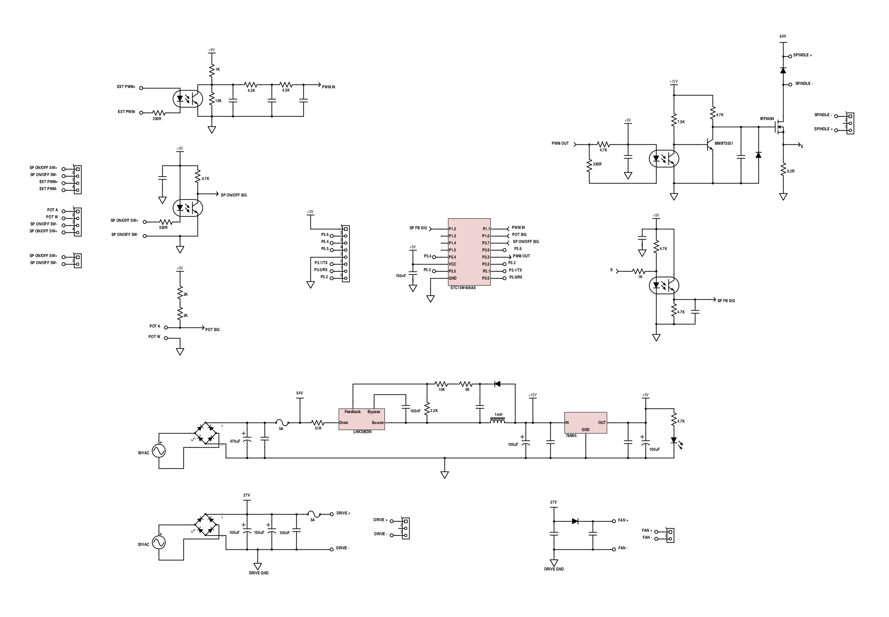

# 3020 SOFTWARE SPINDLE CONTROL

Thanks to [Johnny](https://hackaday.io/Johnny) from [hackaday.io](hackaday.io) for his [fantastic work](https://hackaday.io/project/6776-3040-cnc-milling-machine-mods/log/21618-jp-1482-spindle-controller-schematic) reverse-engeineering the JP-1482 spindle board, seen below:

### Problem

**You cannot control the spindle speed by any means other than the front panel knob.**

The main interface (JP-382C) board routes pin 17 of the parallel port directly to the (unpopulated) "PWM OUT" connector on that board.  

The JP-1482 (spindle control) board has a PWM input, but the firmware on the STC15W408AS (the MCU that ultimately controls spindle speed) _does not_ respond to that input.  

### Solution

The solution is to use another MCU that reads from the existing front-panel knob, and the PWM from the interface board, that then simulates the front panel knob (using a programmable potentiometer).

The goal is to have a board you can simply plug in, and it _just works_.™

### Implementation

For the sake of ease, and getting up-and-running quickly, I opted to use an Arduino Pro Micro (5V), which I happened to have on hand.

The input PWM is buffered through a 6n136 opto isolator, and fed directly into the Arudino.

For output, there is an MCP41010 digital potentiometer, controlled via SPI. Since the front panel pot is 5K, we're only going to use ½ of it's 10K range.

The connectors on the board are compatible with the connectors on the JP-1482; they're the JST XH series.

The software is standard Arduino code, though I'm using PlatformIO cli since I'm not a big fan the Arduino IDE.  Why not bare metal AVR? This isn't a demanding application, and while the Arduino ecosystem isn't the most efficient, it does make it quick and easy to get things up-and-running.
